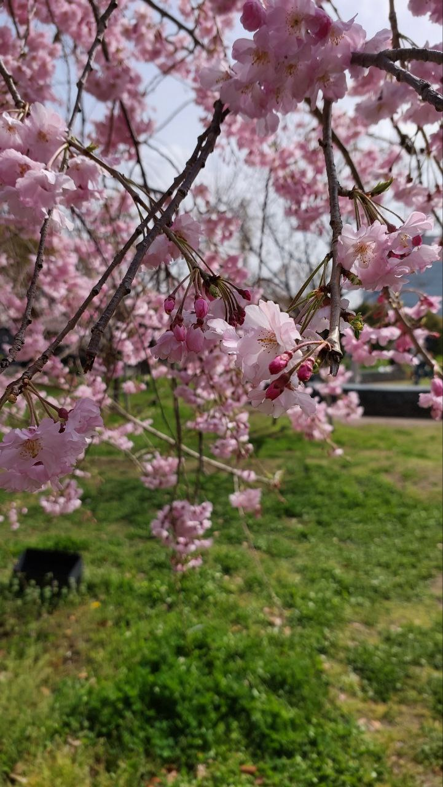
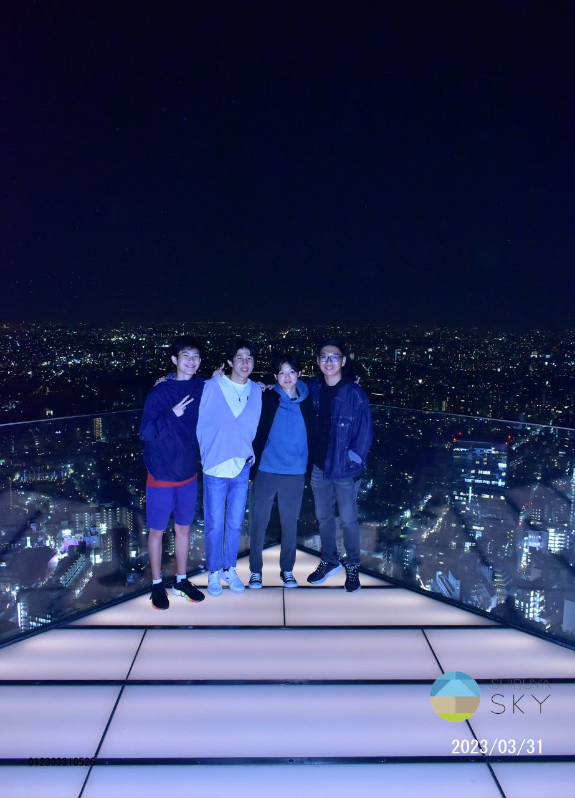

# EGL315-Week-1

## Name
Aloysius Tan

*Aloysius Tan*

**Aloysius Tan**

***Aloysius Tan***

## School
There are two options to insert code

#  Code Lines

### Code Block
```
I am at Nanyang Polytechnic
Block S
Room 540
```

### Code Line
`sudo raspi-config`

## Adding Picture

This is a fantastic picture of a sakura.




## Block Diagram

Left to Right

Top to Down
```mermaid
graph TD
 
 A[RasberryPi]--> B[Router]
 B --> C[TV]
 D[Light Sensor] --> A
 E --> A
 E --> C
 ```